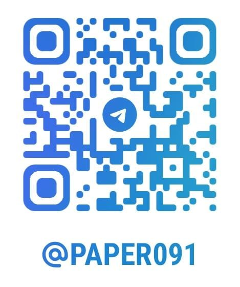

# Hi 👋, I'm paper

> A web and crypto enthusiast trying to get into web 3.0 development. I'm familiar with React.js, Solidity, and blockchain basics. Looking forward to a decentralised world.
  
#### What I've done so far:
- Developed a Text formatting utility tool implemented using React.js, Bootstrap, HTML, JavaScript, as a single page web application. Hosted it live.
- Developed an Ethereum Transaction Fetcher Using python modules like requests, beautifulSoup, pandas, and SQLite3 to fetch alltransactions for a given ERC-20 address and other related data. Further storing it for other applications as well.
- Developed a telegram bot that helps with time zone conversion using python modules like telegram-bot-api. Hosted it live on Heroku's app hosting.
- Developed a bot that notifies the user with the International Space Station's current Location using python modules like iss-notifier-api, twilio messaging service. And hosted it on Heroku.

#### What I'm doing:
- Learning Reactjs framework.
- Open for web development opportunities.

#### Contact Me:
<a href="https://t.me/paper091">

